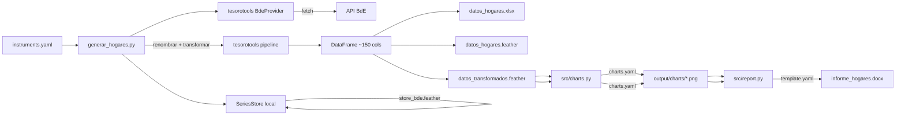
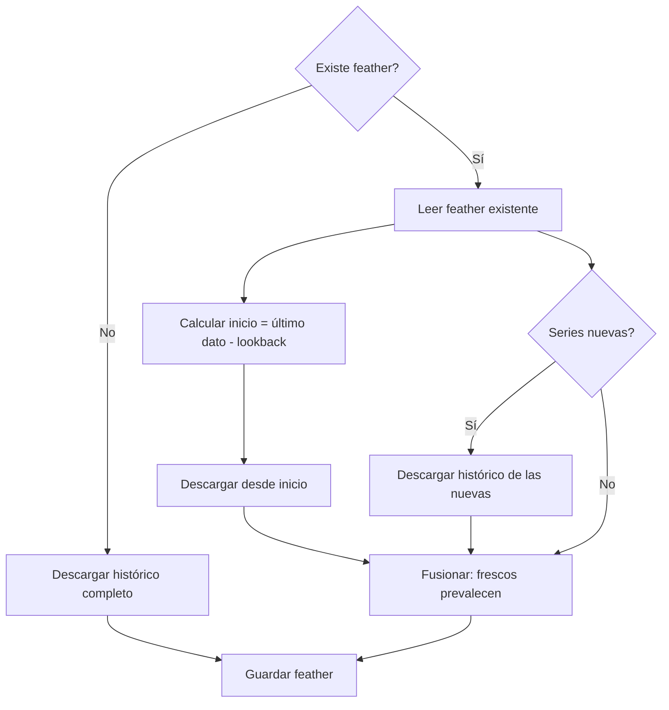

# Arquitectura

Este documento explica las decisiones de diseño del proyecto, cómo
encajan las piezas entre sí, y cómo se relaciona con el resto del
ecosistema de la subdirección (diariospython, tesorotools, series_bbdd).

## Visión general

El proyecto sigue una arquitectura en capas donde cada pieza tiene
una responsabilidad clara: un **provider** descarga datos de una
fuente externa, un **store** gestiona la persistencia local con
actualizaciones incrementales, un **pipeline** convierte los datos
crudos en las magnitudes del informe, unos **artists** generan
gráficos PNG, un **generador de tablas** produce feathers
formateados, y un **template YAML** define la estructura del
documento Word. El **orquestador** (`generar_hogares.py`) conecta
todo.

El provider, el store y el pipeline provienen de tesorotools. Lo
que es local del proyecto es: las reglas concretas de transformación,
la configuración de gráficos/tablas, el template del Word, y el
store (que tiene estrategia de persistencia específica de hogares).

## El provider: BdeProvider (tesorotools)

El proyecto usa `BdeProvider` de `tesorotools.providers.bde`.
La interfaz abstracta `DataProvider` define dos métodos:

- `fetch(codes, start, end)` — descarga series para un rango
  de fechas.
- `is_available()` — comprueba si el servicio responde.

`BdeProvider` tiene dos particularidades:

**Batching**: la API del BdE acepta múltiples series por
petición, pero con demasiadas puede dar timeout. El provider
divide en lotes de 10.

**Rangos restringidos**: la API solo acepta `"30M"`, `"60M"` y
`"MAX"`. El provider traduce automáticamente el `start` al
rango más pequeño que lo cubra.

### Series DCF del BCE

Las cuatro series de stocks de crédito (`DCF_M.N.ES...`) son
del BCE pero el BdE las redistribuye. Un solo provider cubre
las 59 series del catálogo.

## El store: persistencia incremental

`SeriesStore` (`src/store.py`) gestiona `output/store_bde.feather`
— un fichero donde las filas son fechas y las columnas son códigos
BdE crudos. El store implementa actualización incremental:

1. Primera ejecución: descarga todo el histórico.
2. Ejecuciones sucesivas: descarga solo datos nuevos + lookback.
3. Fusiona: datos frescos prevalecen sobre antiguos.

El store trabaja exclusivamente con códigos BdE. El renombrado
a IDs canónicos ocurre después, en el orquestador. Esto evita
contaminar el store con datos transformados (problema que
ocurrió inicialmente cuando el export sobreescribía el store).

## El pipeline de transformaciones

El motor (`TransformationRule` + `apply_transformations`) viene
de `tesorotools.pipeline.engine`. Las factories de reglas
(`scale_rule`, `sum_rule`, `ratio_rule`, `yoy_rule`,
`rolling_sum_rule`) vienen de `tesorotools.pipeline.rules`.

Las reglas concretas de hogares (`src/pipeline/rules.py`) están
organizadas en diez familias, ejecutadas en este orden:

1. **Normalización** (`_BN`): K_EUR/M_EUR/BN_EUR a miles de
   millones. Series PCT se ignoran.
2. **Agregaciones**: totales derivados (flujos totales, otros
   activos + préstamos).
3. **Hipotecas por tipo**: volúmenes y proporciones por tipo
   de interés (variable, mixto, fijo).
4. **Composición** (`CF_PCT_*`): cada activo como fracción del
   total.
5. **Dudosidad** (`DUDOSIDAD_*`): ratio dudosos/crédito total.
6. **Amortizaciones**: flujo implícito de amortización y
   renegociaciones acumuladas.
7. **Descomposición deuda/PIB**: variación intertrimestral
   descompuesta en contribución deuda y PIB.
8. **Tasas interanuales** (`_YOY`): 12 periodos para mensuales,
   4 para trimestrales.
9. **Sumas móviles** (`_4Q`): acumulado de 4 trimestres.
10. **Cambios de stock**: deltas de nivel y residuos de
    revalorización (para gráficos VNA/VNP).

El orden importa: normalización primero (las demás dependen de
`_BN`), agregaciones antes de composición (que divide por el
total), dudosidad antes de tasas (usa series crudas, no `_BN`).

### Frecuencias mixtas

El DataFrame combina series mensuales (crédito, tipos) y
trimestrales (cuentas financieras). Las trimestrales tienen
NaN en fechas mensuales. Esto afecta a:

- **`shift(n)` y `rolling(n)`**: operan sobre filas, no
  periodos. Las factories de tesorotools aplican `dropna()`
  antes para que `n` cuente observaciones reales.
- **Gráficos**: matplotlib dibuja puntos invisibles en fechas
  aisladas. El driver limpia NaN antes de pasar datos a
  LinePlot.

## Generación de gráficos

Los gráficos se definen en `series/charts.yaml`. El driver
`src/charts.py` despacha cada uno al artist de tesorotools:

- **`line`** → `tesorotools.artists.line_plot.LinePlot`
  (acepta DataFrame directo).
- **`stacked_area`** → `tesorotools.artists.stacked.StackedAreaPlot`.
- **`stacked_bar`** → `tesorotools.artists.stacked.StackedBarPlot`.

## Generación de tablas

## Type curve

El type curve pivota datos mensuales por mes del año con
una línea por año, permitiendo comparar la evolución
intra-anual entre distintos años. Soporta acumulación
(`cumulative: true`) para series como renegociaciones
acumuladas. Se renderiza con matplotlib directamente
porque el eje X es categórico (nombres de meses).

## Generación del informe Word

La estructura del documento se define en `series/template.yaml`
usando los custom tags del `TemplateLoader` de tesorotools:
`!report`, `!section`, `!image`, `!images`, `!table`, `!text`,
`!title`. El template referencia los PNGs y feathers generados
por los pasos anteriores.

`src/report.py` carga el template, construye el `Report`, y
lo renderiza a Word con `python-docx`.

## Ficheros de salida

| Fichero | Contenido | Quién lo escribe |
|---|---|---|
| `store_bde.feather` | 59 columnas, códigos BdE crudos | SeriesStore |
| `datos_hogares.xlsx` | ~150 columnas, IDs canónicos | orquestador |
| `datos_hogares.feather` | Igual, con columna `date` | orquestador |
| `datos_transformados.feather` | Igual, con DatetimeIndex | orquestador |
| `charts/*.png` | 26 gráficos | src/charts.py |
| `informe_hogares.docx` | Word final | src/report.py |

`datos_hogares.feather` (con columna `date`) es para consumo
genérico. `datos_transformados.feather` (con DatetimeIndex) es
para los artists y tablas que necesitan indexar por fecha.

## Relación con el ecosistema

Hogares consume de tesorotools:

- `DataProvider`, `BdeProvider` (providers)
- `TransformationRule`, `apply_transformations` (pipeline)
- `scale_rule`, `sum_rule`, `ratio_rule`, `yoy_rule`,
  `rolling_sum_rule` (factories)
- `LinePlot`, `StackedAreaPlot`, `StackedBarPlot` (artists)
- `Report`, `Section`, `Image`, `Images`, `Table`, `Text`,
  `Title` (render)
- `TemplateLoader` (YAML con custom tags)

Lo que es local del proyecto:

- `SeriesStore` — persistencia incremental específica
- `src/pipeline/rules.py` — reglas concretas de hogares
- `src/charts.py` — driver de gráficos (limpieza de NaN)
- `src/report.py` — carga template + render
- `series/*.yaml` — catálogo, gráficos, tablas, template

El formato de `instruments.yaml` es compatible con el del
diario para facilitar convergencia futura.
