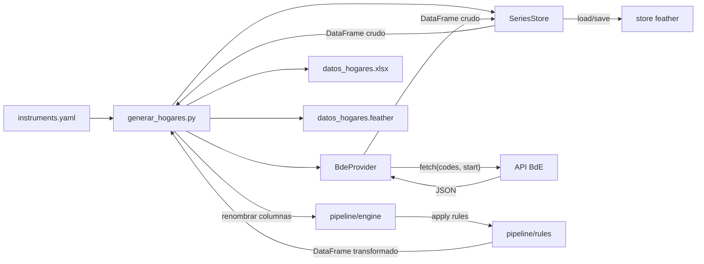
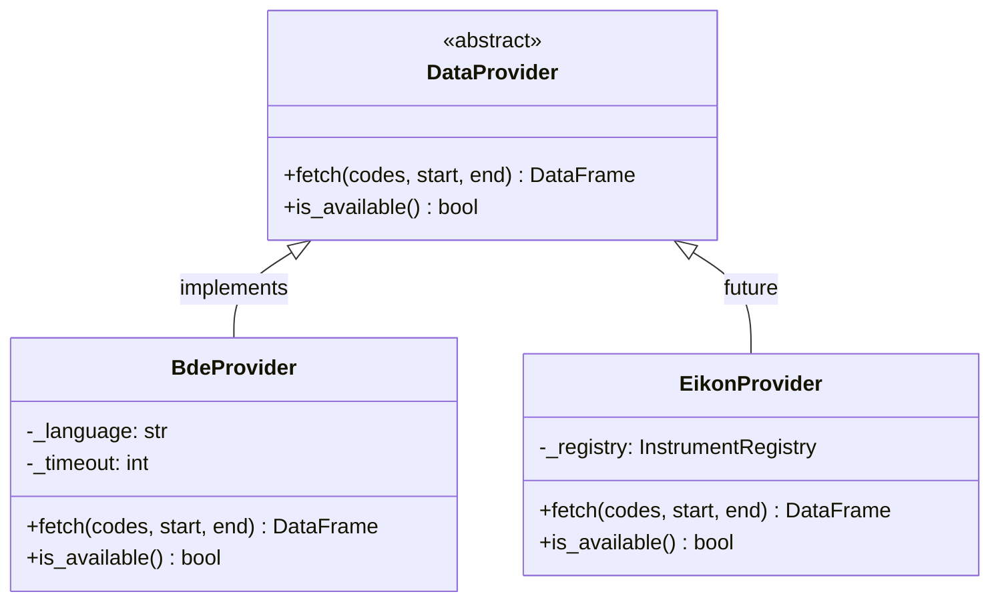
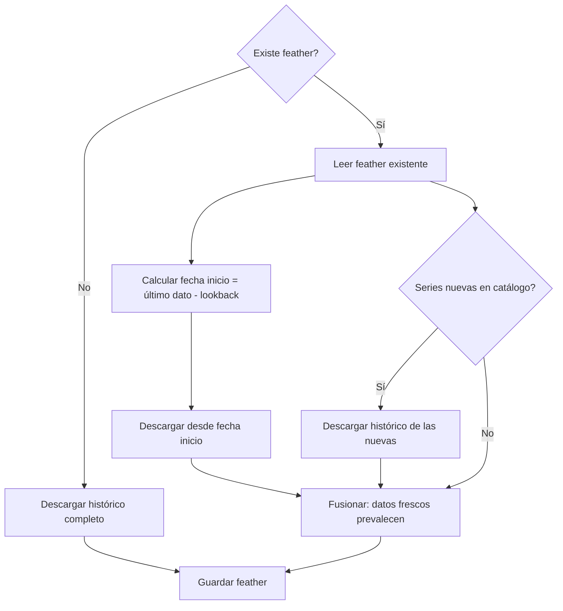
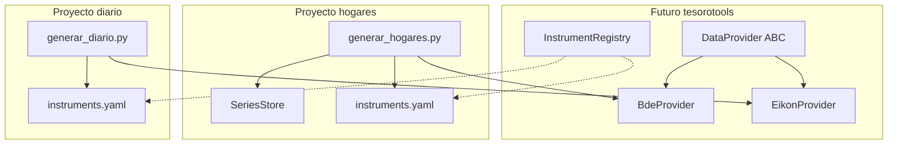

# Arquitectura

Este documento explica las decisiones de diseño del proyecto, cómo
encajan las piezas entre sí, y cómo se relaciona con el resto del
ecosistema de la subdirección (diariospython, tesorotools, series_bbdd).

## Visión general

El proyecto sigue una arquitectura en cuatro capas: un **provider**
que sabe descargar datos de una fuente externa, un **store** que
gestiona la persistencia local con actualizaciones incrementales,
un **pipeline de transformaciones** que convierte los datos crudos
en las magnitudes que necesita el informe, y un **orquestador** que
conecta todo y exporta los resultados.

El provider, el store y el pipeline no se conocen entre sí. El
orquestador es el único que sabe de todos. Esto permite cambiar
la fuente de datos sin tocar las transformaciones, o añadir una
nueva transformación sin tocar la descarga.

## El provider: cómo se descargan los datos

Todos los providers implementan la misma interfaz abstracta
(`DataProvider`, definida en `src/providers/base.py`):

- `fetch(codes, start, end)` — descarga series para un rango de
  fechas. Devuelve un DataFrame con DatetimeIndex y una columna por
  serie.
- `is_available()` — comprueba si el servicio externo responde.

Esta interfaz se diseñó deliberadamente simple y general. La del
proyecto diariospython (`download(date, skip)`) estaba ajustada al
patrón de snapshots intradía de Eikon, que no aplica aquí. Con
`fetch(codes, start, end)` se cubren ambos patrones: para Eikon se
pide un rango de un solo día, para el BdE se pide el histórico
completo o un rango de meses.

La interfaz `DataProvider` tiene vocación de migrar a tesorotools en
el futuro. Cuando eso ocurra, el `BdeProvider` de este proyecto y el
`EikonProvider` del diario implementarán la misma ABC, y cualquier
proyecto nuevo podrá usar cualquier provider sin conocer sus detalles.

### BdeProvider

La implementación concreta para el Banco de España
(`src/providers/bde.py`) tiene dos particularidades:

**Batching**: la API del BdE acepta múltiples series en una sola
petición, pero con demasiadas puede dar timeout. El provider divide
las peticiones en lotes de 10 series.

**Rangos restringidos**: la API no acepta rangos arbitrarios de
fechas. Solo acepta `"30M"` (30 meses), `"60M"` (60 meses) y `"MAX"`
(todo el histórico). El provider traduce automáticamente el parámetro
`start` al rango más pequeño que lo cubra, y luego recorta el
DataFrame resultante para respetar la fecha solicitada.

### Sobre las series DCF del BCE

Las cuatro series de stocks de crédito (`DCF_M.N.ES...`) son
originalmente del Banco Central Europeo. Sin embargo, el BdE las
redistribuye a través de su propia API, de modo que se descargan
exactamente igual que las series propias del BdE. Esto simplifica
el proyecto: un solo provider cubre las 53 series.

El paquete R `ecb` que cargaban los scripts originales nunca se
usaba realmente; toda la descarga pasaba por `bdeseries`, que
también obtiene estas series del BdE.

## El store: persistencia incremental

El `SeriesStore` (`src/store.py`) gestiona un único fichero feather
donde las filas son fechas y las columnas son códigos de series.

El proyecto está pensado para ejecutarse trimestralmente. No tiene
sentido descargar décadas de histórico cada vez. El store implementa
actualización incremental:

1. En la primera ejecución (sin feather previo), descarga todo el
   histórico y lo guarda.
2. En ejecuciones sucesivas, lee el feather existente, calcula qué
   datos faltan, y pide al provider solo los datos nuevos más una
   ventana de lookback configurable para capturar revisiones
   estadísticas.
3. Fusiona los datos nuevos con los existentes: donde hay
   solapamiento, los datos frescos prevalecen (por si hubo
   revisiones).

El lookback se configura con el flag `--lookback` (por defecto 4
trimestres, es decir, un año hacia atrás). Se puede poner a 0 para
no re-verificar datos previos, o usar `--full` para forzar una
re-descarga completa.

El store es código local del proyecto, no forma parte de tesorotools.
Cada proyecto del ecosistema puede tener su propia estrategia de
persistencia.

## El pipeline de transformaciones

El pipeline (`src/pipeline/`) tiene dos módulos:

**engine.py** contiene el motor genérico, replicado del proyecto
diariospython. Su pieza central es el dataclass
`TransformationRule`, que agrupa un nombre de salida, una lista de
dependencias, y una función de cálculo pura. La función
`apply_transformations` aplica las reglas secuencialmente sobre un
DataFrame, saltándose las que tengan dependencias ausentes.

**rules.py** contiene las reglas específicas de hogares, organizadas
en cinco familias:

- **Normalización de unidades**: lee el campo `unit` de cada serie
  en el catálogo (K_EUR, M_EUR, BN_EUR) y genera una columna con
  sufijo `_BN` convertida a miles de millones de euros. Las series
  en porcentaje (PCT) se ignoran.
- **Agregaciones**: totales derivados (flujos totales, otros activos
  + préstamos).
- **Composición**: cada categoría de activo como fracción del total.
- **Tasas interanuales**: variación año sobre año (12 periodos para
  mensuales, 4 para trimestrales). Sufijo `_YOY`.
- **Sumas móviles**: acumulado de 4 trimestres para anualizar flujos
  trimestrales. Sufijo `_4Q`.

El orden importa: primero la normalización (porque las agregaciones
y ratios dependen de las columnas `_BN`), luego agregaciones, luego
composición y tasas (que dependen de las agregaciones).

El motor tiene vocación de migrar a tesorotools. Las reglas se
quedan aquí porque son conocimiento de negocio del informe.

## El orquestador: generar_hogares.py

El script principal conecta las piezas:

1. Lee el catálogo `series/instruments.yaml`.
2. Extrae el mapeo ID canónico a código BdE.
3. Pasa los códigos BdE al store, que decide si hacer descarga
   completa o incremental.
4. Renombra las columnas del DataFrame de códigos BdE a IDs
   canónicos.
5. Aplica las reglas de transformación (normalización, agregaciones,
   ratios, tasas, sumas móviles). Esto genera 36 columnas derivadas
   a partir de las 53 originales.
6. Exporta el DataFrame transformado (89 columnas) a Excel y
   feather.

Los IDs canónicos (como `STOCK_VIVIENDA`) se usan en el DataFrame
de salida y en todo el código aguas abajo. Los códigos del proveedor
(como `DCF_M.N.ES...`) solo aparecen en el catálogo y dentro del
provider.

## El catálogo: instruments.yaml

Sigue el mismo esquema que el proyecto diariospython: cada serie
tiene un ID canónico como clave, un `display_name` legible, y un
bloque `providers` con la configuración específica del proveedor.

Esto facilita una futura migración a tesorotools: el
`InstrumentRegistry` del diario ya sabe leer este formato.

## Relación con el ecosistema

Este proyecto es un consumidor potencial de tesorotools, no una
dependencia. Actualmente no importa nada de tesorotools. La
estrategia es:

- La ABC `DataProvider` se diseña aquí y se migrará a tesorotools
  cuando se consolide el paquete.
- El `BdeProvider` se extraerá a tesorotools cuando otros proyectos
  lo necesiten.
- El `SeriesStore` se queda aquí porque es específico de este
  proyecto.
- El formato de `instruments.yaml` es compatible con el del diario
  para facilitar la convergencia futura.

